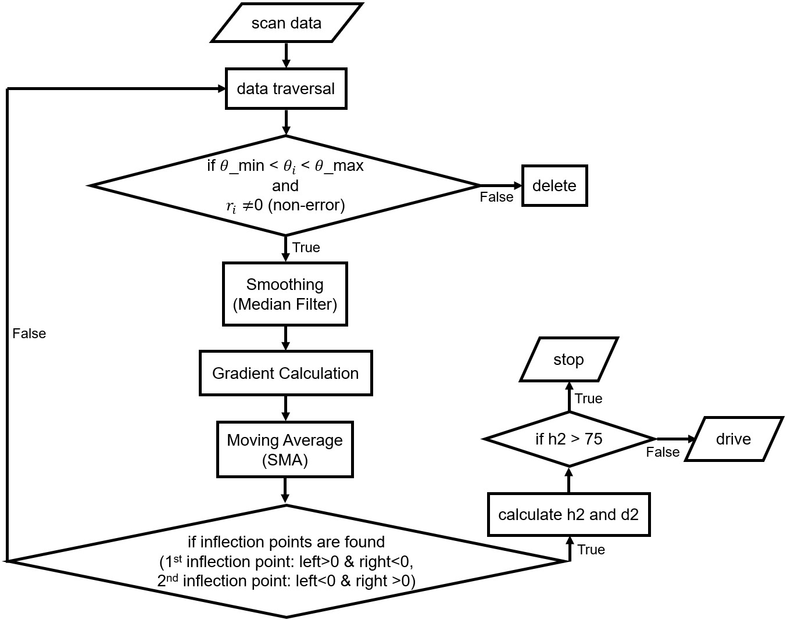

# StepDetectionVia2DLiDAR
This paper [Development of a Safety Assistance System Based on Computer Vision for Mobility Scooters](https://www.jstage.jst.go.jp/article/sss/2023/0/2023_19/_pdf) has been accpeted by ISCIE International Symposium on Stochastic Systems Theory and its Applications (ISCIE-SSS 2022).




Mobility Scooters (MS) have a weak capability in ascending a step or descending a ditch which may even lead to a fall accident when the step/ditch is higher than 7.5cm (MS chassis height) or non-vertical to the driving direction. Hence to detect this category of danger, we propose methods to detect the step and the ditch via a vertically placed 2D LiDAR [SLAMTEC RPLIDAR S2](https://www.slamtec.ai/product/slamtec-rplidar-s2/).

Firstly, we reduce the noise by smoothing (only for step detection). Next, we find the inflection points or the breakpoint of the distance change to detect the step or the ditch, respectively. Thus, (1) step distance (the distance from the MS to the step), (2) step height, (3) ditch distance and (4) ditch depth can all be estimated. Finally, we predict whether the driving direction is approximately perpendicular to the line of the step or the ditch by using the omnidirectional camera. 

Through experiments, we have found that our proposed algorithm can detect steps or ditches within a range of 10m, especially smaller than 7.5 cm or even 3cm sometimes. Furthermore, the specific measured distance error depends on the raw ToF performance of [SLAMTEC RPLIDAR S2](https://www.slamtec.ai/product/slamtec-rplidar-s2/).


## C++
Although this sensor uses the C++ SDK [Slamtec RPLIDAR Public SDK for C++](https://github.com/Slamtec/rplidar_sdk) as you can follow the following steps to obtain the 2D point clouds, but the speed is not obviously as fast as python. And the compilation time and code writing time are longer than python.

#### compile
```
open solution "./workspaces/vc14/sdk_and_demo.sln" in visual studio 2019
edit c++ code "./app/ultra_simple/main.cpp"
build solution
executive file "./output/win32/Debug/ultra_simple.exe" will be created
```
#### execute to get 2D point cloud
```
cd ./RPLiDAR_SDK/output/win32/Debug
ultra_simple --channel --serial \\.\com6 1000000 # CUI
frame_grabber --channel --serial \\.\com6 1000000 # GUI
```


# Usage
Therefore, we use this python SDK [PyRPLiDAR](https://github.com/Hyun-je/pyrplidar) to　obtain raw 2D point clouds in real time by using 2D LiDAR with a serial interface.

## Dependencies 
```
python=3.8
pandas
scipy
pyrplidar
```

# Demo & experiments
## Step/ditch detection and distance/height estimation via left/right monocular LiDAR


```
step_detection_1LiDAR_l.py or step_detection_1LiDAR_r.py
```

## Step/ditch direction estimation via left+right binocular LiDARs


```
step_detection_2LiDARs.py
```

## Gaussian filter based time series due to vibration problem


```
step_detection_2LiDARs.py
```